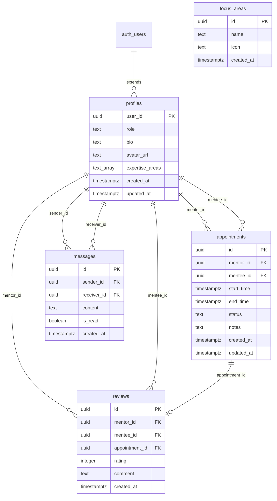

# Supabase Database Schema

## Tables Overview

| Table | Purpose | Key Relationships |
|-------|---------|-------------------|
| profiles | User profiles extending auth.users | References auth.users(id) |
| focus_areas | Predefined coaching categories | Referenced by mentor expertise |
| appointments | Booking records | References profiles (mentor & mentee) |
| messages | Chat messages | References profiles (sender & receiver) |
| reviews | Mentor ratings | References profiles & appointments |

## RLS Policies Summary

- **profiles**: Public read, owner write
- **appointments**: Private to participants
- **messages**: Private to sender/receiver, realtime enabled
- **reviews**: Public read, reviewer write
- **focus_areas**: Public read-only

## Functions

- `check_mentor_availability(mentor_id, start_time, end_time)`: Returns boolean
- `get_mentor_booked_slots(mentor_id, start_date, end_date)`: Returns booked slots

## Indexes

Optimized for:
- Mentor/mentee appointment lookups
- Message conversation queries
- Review aggregations by mentor

## Diagram

